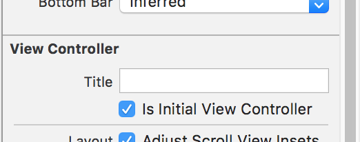
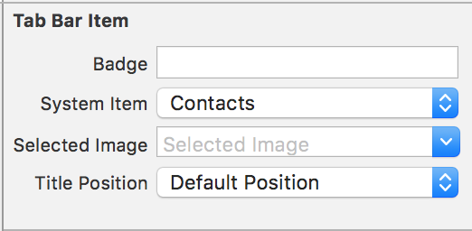
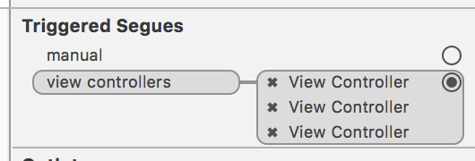
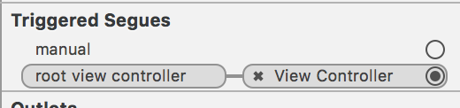
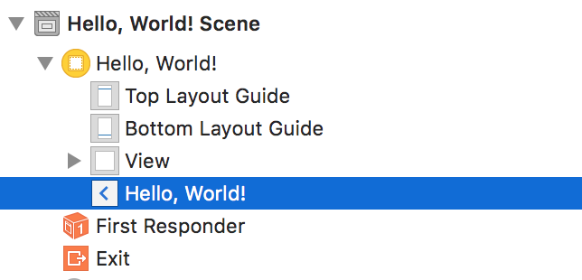
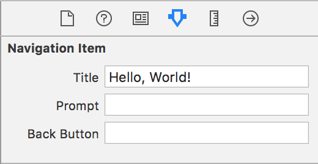
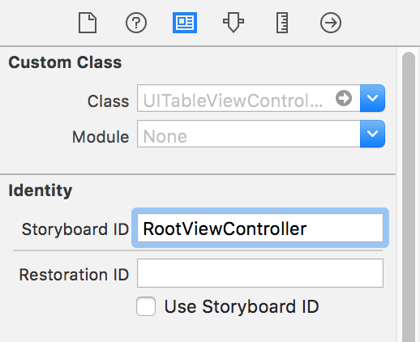

# UI Controllers

We've implemented our own view controller, but iOS comes with a bunch of others that make our lives easier. For now,
let's go over two that have to do with navigating between other view controllers. These aren't the only kinds of
controllers iOS provides however, and others do everything from managing tables and lists to showing popup views.

## Tab Bar Controllers

Tab view controllers manage tab bars like the one in the Music app.

We can add one to our app by searching for "Tab Bar
Controller" in the Object Library and dragging it onto the scene. We'll need to change our storyboard to start with
this instead of our view controller. On the panel on the right, select the Attributes Inspector (the middle option in
tab bar at the top). Under the "View Controller" section, there should be an option for "Is Initial View Controller".
Make sure it's checked so that iOS will start with the tab bar controller.



By default, Xcode creates two new scenes with new view controllers for your tab bar.
Click on one of them and find the corresponding Tab Bar Item in the scene on the
left panel (it'll look like a white square with a blue star). Give it an icon
by choosing one from the "System Item" dropdown (you can also use an icon of your own).



Drag a label onto the view and add some text to it. Do the same to the other new view so
we can tell them apart. Try running the app and switching between the two tabs!

We can also add our existing view controller as a tab. Select the Tab Bar Controller scene
and go to the Connections inspector. Next to "view controllers" under "Triggered Segues"
you should see two view controller entries - the ones added by Xcode. Drag from the filled
circle (which should change to a plus when you hover over it) all the way over to your view controller.



This will create an item in your view controller's scene, where you can tweak the icon
and text.

Run the app again and you should be able to get to all three view controllers!

Besides being a useful way to get around in your apps, tab bar controllers show how a lot
of view controllers, particularly the Apple-provided ones, work with other view controllers
to make all sorts of magic happen 🎉

## Navigation Controllers

Navigation controllers keep track of which view controllers have been visited, like a back button
in a browser.

Adding one is similar to adding a tab bar controller. Just search for "Navigation Controller" in
the Object Library and drag it onto the storyboard. Remember to set "Is Initial View Controller".

As before, Xcode creates a default view controller along with the navigation controller.
We'll want to change the view controller to start out at our view controller instead of this one.
To do that, go to the connections for the navigation controller and delete the "root view controller" triggered segue. Once you've done that, add a new "root view controller" connection
to the view controller we already created.



We can also customize the title that will be displayed for each view controller using its
navigation item. If you expand the view controller scene in the left sidebar, there will be an
entry for the navigation item, a white square with a blue caret.



With this selected, go to the Attributes inspector and set the Title property.



Now, when you run the app there will be a title bar at the top saying "Hello, World!" 👋

A navigation controller isn't very useful with only one page to look at, but we can fix that!

In your view controller code, find one of the button handlers and add the following code:

```swift
let newVC = storyboard?.instantiateViewController(withIdentifier: "RootViewController")
navigationController?.pushViewController(newVC!, animated: true)
```

All view controllers have `navigationController` and `storyboard` properties that let them access
the containing navigation controller and storyboard. We use the navigation controller's
`pushViewController` method, which presents a view controller and adds it to the history stack.
The `animated` flag determines whether to show a transition or just change the controller.

The `instantiateViewController` method on storyboards creates a new instance of the view controller
with the given name. For this to work, we need to give the view controller Xcode added for us
an identifier so it can be looked up later. This is done in the storyboard by setting the
"Storyboard ID" in the Identity inspector.



When you run the app, try going back and forth between the two views using the code
you added and the "Back" button the navigation controller provides. Adding in a navigation
controller gives us a ton of functionality without too much work - we can push and pop
view controllers as much as we want without having to worry!
